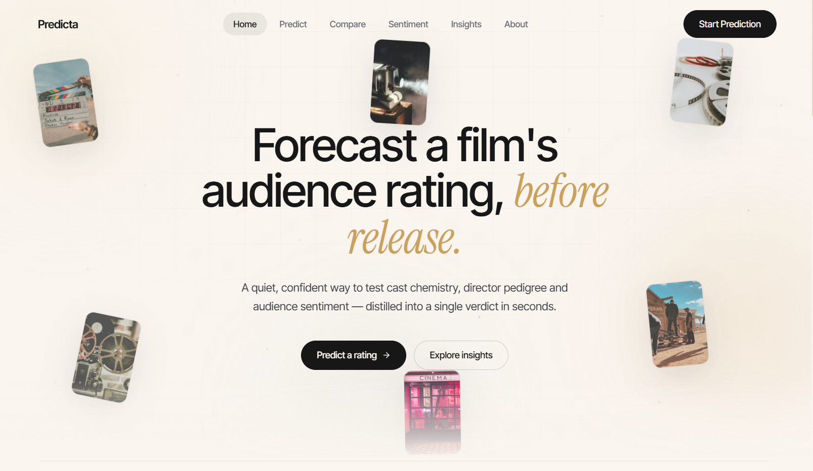
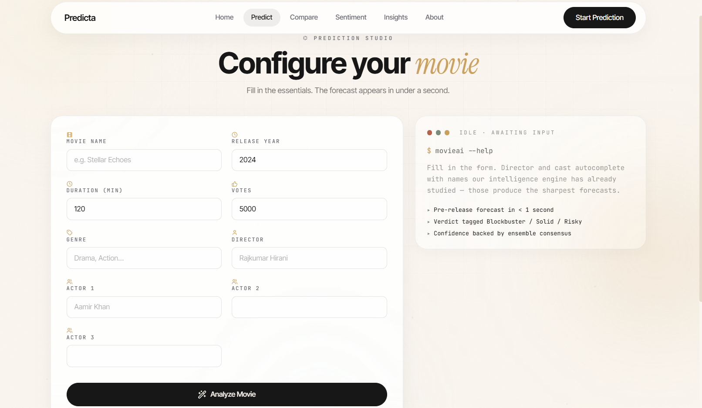
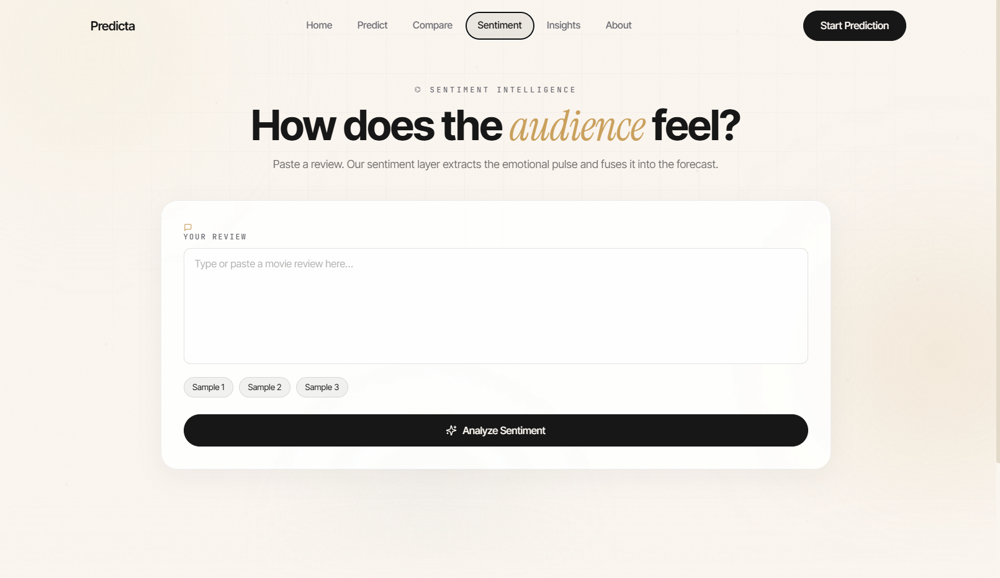

# 🎬 Predicta — Movie Rating Prediction Platform

Predicta is an AI-powered movie rating prediction platform that forecasts audience ratings before a movie is released by combining movie metadata, historical patterns, and audience sentiment analysis.

Built with React, FastAPI, MongoDB, and Machine Learning.

---

## ✨ Features

* 🎯 Movie Rating Prediction
* 💬 Audience Sentiment Analysis
* ⚔️ Head-to-Head Movie Comparison
* 📊 Analytics Dashboard
* 🔍 Smart Autocomplete Suggestions
* 📄 PDF Export Support
* 🔗 Shareable Prediction Links
* 🎨 Modern Premium UI Experience
* 📱 Responsive Design

---

## 📸 Screenshots

### Home Page



### Prediction Studio



### Sentiment Intelligence



---

## 🏗️ Tech Stack

### Frontend

* React
* Tailwind CSS
* Framer Motion
* Recharts
* Axios
* React Helmet Async
* jsPDF

### Backend

* FastAPI
* Scikit-Learn
* Pandas
* NumPy
* TextBlob
* MongoDB
* Motor
* Joblib

---

## 🚀 Installation

### Clone Repository

```bash
git clone https://github.com/AryanMehta125/predicta-movie-rating-prediction.git
cd predicta-movie-rating-prediction
```

### Frontend Setup

```bash
cd frontend
npm install
npm start
```

### Backend Setup

```bash
cd backend
pip install -r requirements.txt
uvicorn server:app --reload
```

---

## ⚙️ Environment Variables

### backend/.env

```env
MONGO_URL=mongodb://localhost:27017
DB_NAME=predicta
```

### frontend/.env

```env
REACT_APP_BACKEND_URL=http://127.0.0.1:8000
```

---

## 📡 API Endpoints

| Method | Endpoint          | Description              |
| ------ | ----------------- | ------------------------ |
| GET    | /api/health       | Health Check             |
| POST   | /api/predict      | Predict Movie Rating     |
| POST   | /api/compare      | Compare Movies           |
| POST   | /api/sentiment    | Analyze Sentiment        |
| POST   | /api/final-rating | Combined Verdict         |
| GET    | /api/analytics    | Analytics Dashboard      |
| GET    | /api/model-info   | Model Information        |
| GET    | /api/suggestions  | Autocomplete Suggestions |

---

## 📊 Dataset

This project uses movie-related datasets sourced from Kaggle and further processed for model training and experimentation.

Dataset credits belong to their respective creators.

---

## 🤝 Contributing

Contributions are welcome.

You can contribute through:

* Bug fixes
* UI improvements
* Model enhancements
* API improvements
* Documentation updates
* New features

Project extensions and scalability improvements are highly appreciated.

Please read the CONTRIBUTING.md guide before submitting a Pull Request.

---

## 🛣️ Future Roadmap

* TMDB Integration
* Recommendation Engine
* User Authentication
* Personal Prediction History
* Advanced NLP Sentiment Models
* Mobile Application
* Cloud Deployment Templates

---

## 👨‍💻 Author

**Aryan Mehta**

AI • Full Stack Development • Machine Learning

GitHub: https://github.com/AryanMehta125

---

## ⭐ Support

If you find this project useful, consider giving it a star.
